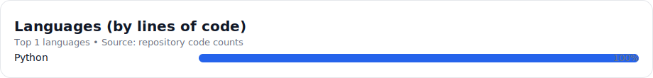

<table width="100%" border="0" cellspacing="0" cellpadding="0" style="border:none;">
  <tr style="border:none;">
    <td align="left" valign="bottom" style="border:none; padding:0;">
      

        CiCwtch
      

    </td>
    <td align="right" valign="bottom" style="border:none; padding:0; width: 1%;">
      

        
      

    </td>
  </tr>
</table>

---

## 🐶 CiCwtch

CiCwtch is a structured digital platform designed for small dog walking and pet care businesses across the UK and Europe.

It began as a passion project — an attempt to build something calmer, clearer, and more dependable than the tools I could find. What started as solving small, everyday frustrations has grown into a disciplined effort to create a platform that balances warmth with technical integrity.

CiCwtch is engineered with long-term architectural stability in mind. The aim is simple: dependable systems for professionals, reassuring simplicity for families.

---

### About the Builder

  

I build for peace, for enjoyment, and to fix the little inefficiencies in my world.

Dogs keep me grounded — especially Bentley, my delightfully bonkers Cavapoo. 🐾

I am autistic, and the structured puzzles of engineering — whether an application, infrastructure, or a Home Assistant system — bring a kind of quiet order to an otherwise noisy world. There is something quietly powerful about improving what is right in front of you, properly and with care.

CiCwtch is built in that spirit.

---

## 🛠️ Development Status

CiCwtch is currently in development.

  
  
  

This repository is publicly visible to support structured collaboration and transparency during the build phase.

---

### 🚀 Built With

These are some of the core technologies and frameworks used in the project:

  
  
  
  
  

### 👨‍💻 Languages

  

---

## 🤝 Collaboration & Community

  
  
  

CiCwtch welcomes thoughtful and structured collaboration.

Before submitting substantial changes, please open a GitHub Issue or Discussion to align on direction and scope. This maintains architectural coherence and avoids duplicated effort.

Areas where collaboration is especially valuable:

- Frontend and backend engineering  
- UX and accessibility refinement  
- Welsh language localisation  
- Documentation and technical clarity  
- Security review  

By contributing, you acknowledge that contributions may be incorporated into future commercial versions of the platform. All contributors must be approved and agree to the contribution agreement found here: *(insert link)*.

### For discussion and community engagement

  

  

---

### Sponsorship and support

  

  

---

## 📜 Licensing Information

Copyright © 2026 Nathan Jones  
All rights reserved.

This software is **not open source** at this time.

No permission is granted to copy, modify, distribute, sublicense, or commercially exploit this software, in whole or in part, without explicit written permission from the copyright holder.

---

  Built in Wales 🛠️ Designed with Cwtch 
  Adeiladwyd yng Nghymru 🏴 Dyluniwyd gyda Cwtch

