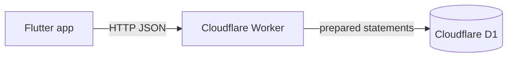
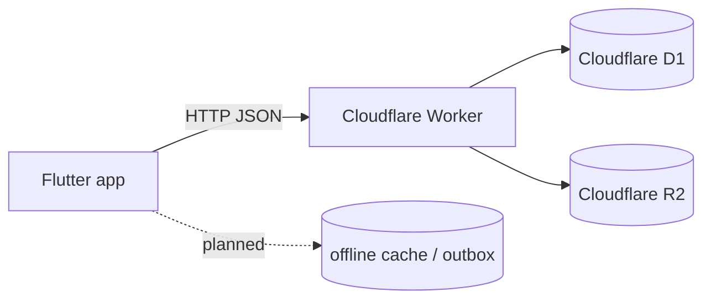

# Data Architecture

## Canonical stores

### Currently implemented
- **Cloudflare D1** is the intended canonical relational store.
- The active application code currently reads/writes only the `clients` table.

### Planned but not yet implemented in code
- **Cloudflare R2** for attachments/media
- local offline storage and sync queue in Flutter

## Current schema reality

`migrations/0001_initial_schema.sql` defines these top-level tables:

- `addresses`
- `clients`
- `client_contacts`
- `dogs`
- `dog_notes`
- `walkers`
- `walker_compliance_items`
- `walks`
- `walk_reports`
- `invoice_headers`
- `invoice_lines`
- `attachments`
- `audit_log`

This schema expresses the intended data model, but most of these entities are not yet wired into the current frontend/backend runtime.

## Data privacy inventory linkage

The privacy inventory lives alongside the code in:
- `.fides/`
- `docs/gdpr/`

Whenever a table or sensitive field changes, update:
- `migrations/0001_initial_schema.sql` or a later migration
- `.fides/dataset.yml`
- relevant docs in `docs/gdpr/`

## Current live data flow

## Future data flow direction

