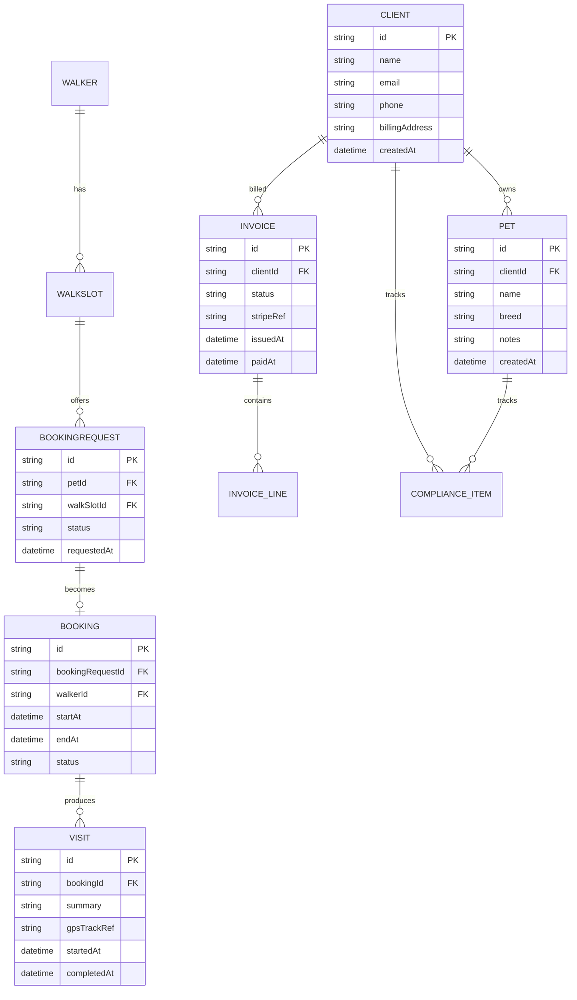

<!-- HEADER BADGES -->

&nbsp;

&nbsp;
  

# CiCwtch - Data Architecture
## Architecture & Engineering Source of Truth

  
  &nbsp;
  
  &nbsp;
  

CiCwtch treats data as a first-class product: it must be consistent, auditable (where needed), and resilient offline.

---

## 1) Canonical data stores

### Server-side (system of record)
- **Cloudflare D1 (SQL)**: canonical relational store
- **Cloudflare R2 (objects)**: photos, PDFs, media attachments

### Client-side (offline capability)
- **SQLite**: cached reads + offline writes + outbox queue

---

## 2) Core entities (conceptual)

- `Client` (pet owner / billing contact)
- `Pet` (belongs to a Client)
- `Walker` (staff member / contractor)
- `WalkSlot` (capacity inventory)
- `BookingRequest` (client asks)
- `Booking` (approved scheduled visit)
- `Visit` (execution record + notes + GPS + media)
- `Invoice` (financial record)
- `ComplianceItem` (insurance/certs/vaccinations expiry etc.)

---

## 3) Conceptual ER diagram (Mermaid)

---

## 4) Consistency rules (server)

- Capacity cannot be over-allocated:
  - Approving a booking is a transaction: check capacity → allocate → commit.
- A `Visit` must reference a valid `Booking`.
- Invoice status is updated only by:
  - Admin action (issue/cancel) and/or
  - Stripe webhook reconciliation (paid/failed)

---

## 5) Offline sync rules (client)

- Local SQLite is the source of truth while offline.
- Outbox items are applied in deterministic order.
- If the server rejects a write due to conflict:
  - Store server response and mark item “NEEDS_ATTENTION”
  - UI surfaces a “Resolve” action (policy varies by entity)

**Principle:** silent data loss is forbidden.

---

  Built in Wales ❤️ Designed with Cwtch 
  Adeiladwyd yng Nghymru ❤️ Dyluniwyd gyda Cwtch

