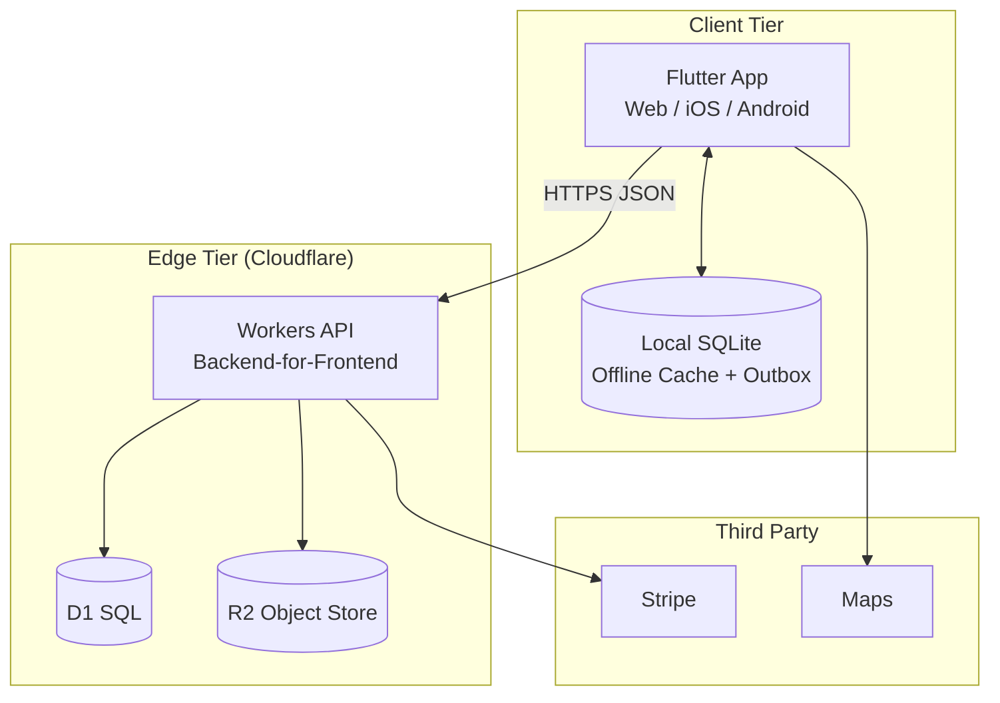
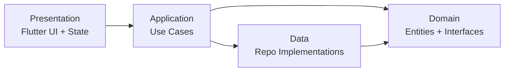
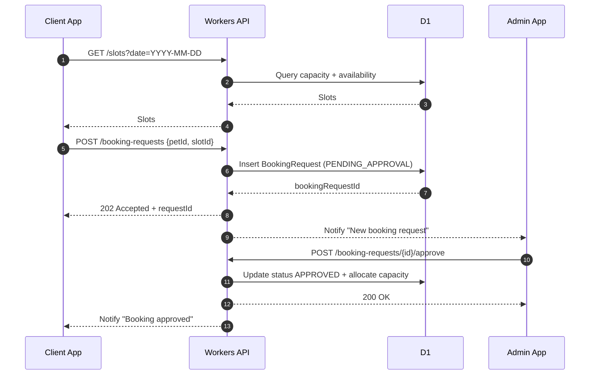
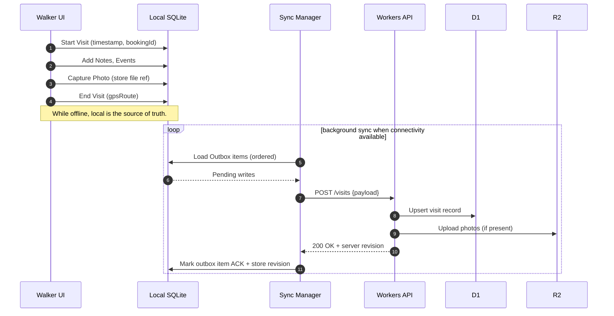
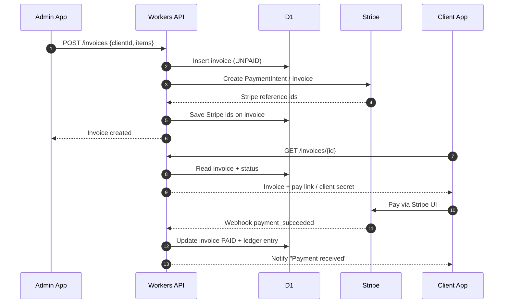

<!-- HEADER BADGES -->
<p align="right">
<a href="https://github.com/nathcymru/CiCwtch/actions/workflows/ci.yml"></a>
&nbsp;
<a href="https://github.com/nathcymru/CiCwtch/releases"></a>
&nbsp;
  <a href="https://github.com/nathcymru/CiCwtch/commits/main"></a>
</p clear="right">

# CiCwtch - Architecture Diagrams (Mermaid)
## Architecture & Engineering Source of Truth

<p align="left">
  <a href="https://flutter.dev/"></a>
  &nbsp;
  <a href="https://developers.cloudflare.com/workers/"></a>
  &nbsp;
  <a href="https://developers.cloudflare.com/d1/"></a>
</p>

This file contains the **canonical diagrams**.  
When changing architecture, update these diagrams first — they are the quickest way to spot broken assumptions.

---

## 1) C4 — System Context

```mermaid
flowchart LR
  subgraph Users
    C[Client\n(Pet Owner)]
    W[Walker\n(Field Staff)]
    A[Admin\n(Business Owner)]
  end

  subgraph CiCwtch["CiCwtch Platform"]
    App[Flutter App\nWeb / iOS / Android]
    API[Cloudflare Workers\nBFF API]
  end

  subgraph External["External Systems"]
    Stripe[Stripe\nPayments & Subscriptions]
    Maps[Maps Provider\nGoogle/Apple]
    Notify[Push Notifications\nAPNs/FCM/Web Push]
  end

  DB[(Cloudflare D1\nRelational Data)]
  OBJ[(Cloudflare R2\nObjects: photos, PDFs)]

  C -->|use| App
  W -->|use| App
  A -->|use| App

  App -->|HTTPS JSON| API
  API -->|SQL| DB
  API -->|PUT/GET objects| OBJ

  API -->|payments webhooks / intents| Stripe
  App -->|location / routing| Maps
  API -->|send notifications| Notify
```

---

## 2) C4 — Container Diagram



---

## 3) Clean Architecture Layering (App internals)



---

## 4) “Happy Path” — Client booking request → approval



---

## 5) Offline walk execution → sync



---

## 6) Payment flow — invoice → Stripe → webhook reconciliation



---
<p align="center">
  Built in Wales ❤️ Designed with Cwtch<br/>
  Adeiladwyd yng Nghymru ❤️ Dyluniwyd gyda Cwtch
</p>
