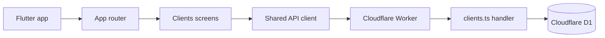
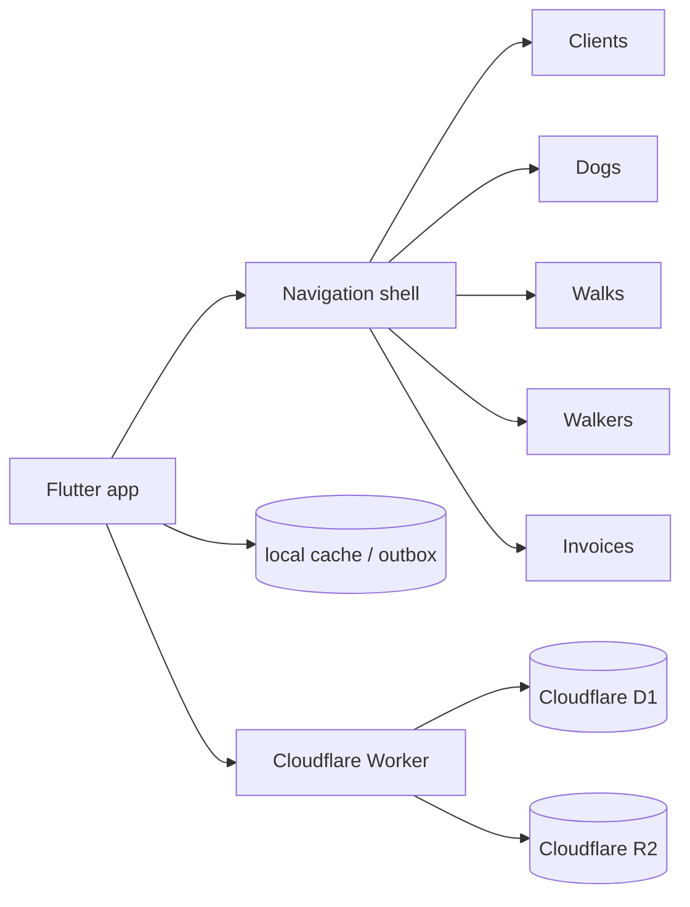

# Diagrams

## Current runtime diagram

```mermaid
flowchart LR
  UI[Flutter app] --> Router[App router]
  Router --> ClientsUI[Clients screens]
  ClientsUI --> ApiClient[Shared API client]
  ApiClient --> Worker[Cloudflare Worker]
  Worker --> ClientsHandler[clients.ts handler]
  ClientsHandler --> D1[(Cloudflare D1)]
```

## Planned target diagram

```mermaid
flowchart LR
  UI[Flutter app] --> Shell[Navigation shell]
  Shell --> Clients
  Shell --> Dogs
  Shell --> Walks
  Shell --> Walkers
  Shell --> Invoices
  UI --> Offline[(local cache / outbox)]
  UI --> Worker[Cloudflare Worker]
  Worker --> D1[(Cloudflare D1)]
  Worker --> R2[(Cloudflare R2)]
```
