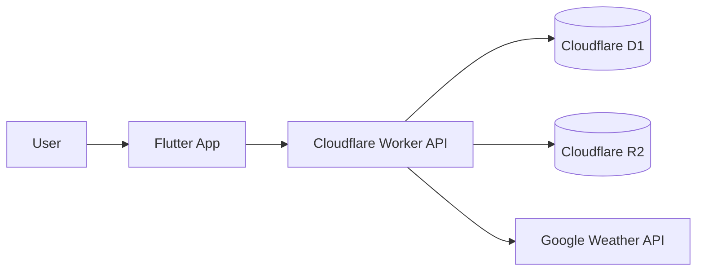
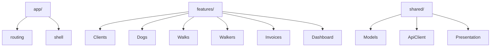
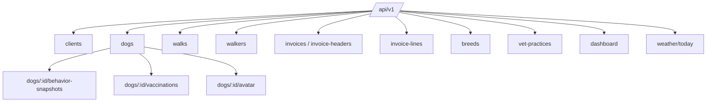

<!-- HEADER BADGES -->

&nbsp;

&nbsp;
  

# CiCwtch - Architecture Diagrams
## Simple diagrams reflecting the current implemented topology

  
  &nbsp;
  
  &nbsp;
  
  &nbsp;
  

## Runtime overview

## Frontend structure

## API resources

---

  Built in Wales ❤️ Designed with Cwtch 
  Adeiladwyd yng Nghymru ❤️ Dyluniwyd gyda Cwtch

