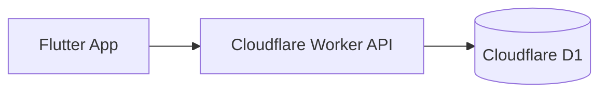
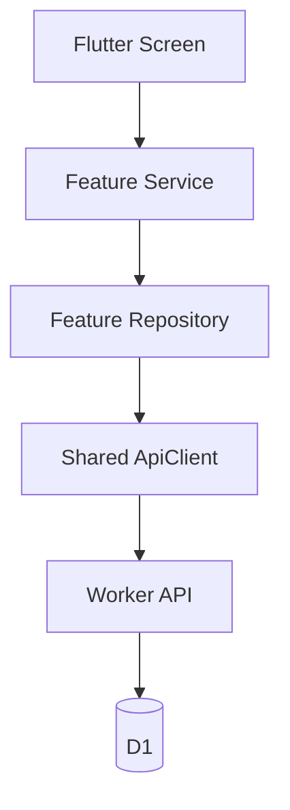
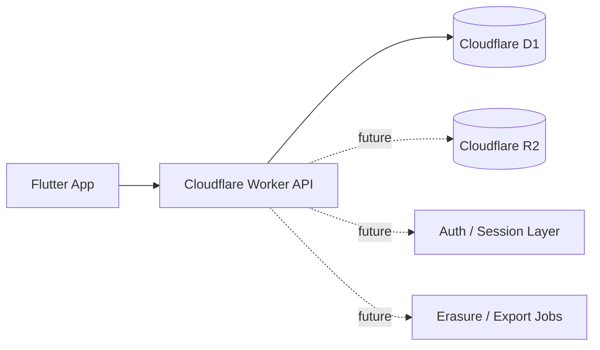

# Diagrams

## Current implemented runtime

```mermaid
flowchart LR
  U[Flutter App] --> API[Cloudflare Worker API]
  API --> D1[(Cloudflare D1)]
```

## Current app layering

```mermaid
flowchart TD
  Screen[Flutter Screen] --> Service[Feature Service]
  Service --> Repo[Feature Repository]
  Repo --> ApiClient[Shared ApiClient]
  ApiClient --> Worker[Worker API]
  Worker --> D1[(D1)]
```

## Planned but not yet implemented

```mermaid
flowchart LR
  U[Flutter App] --> API[Cloudflare Worker API]
  API --> D1[(Cloudflare D1)]
  API -. future .-> R2[(Cloudflare R2)]
  API -. future .-> Auth[Auth / Session Layer]
  API -. future .-> DSAR[Erasure / Export Jobs]
```
