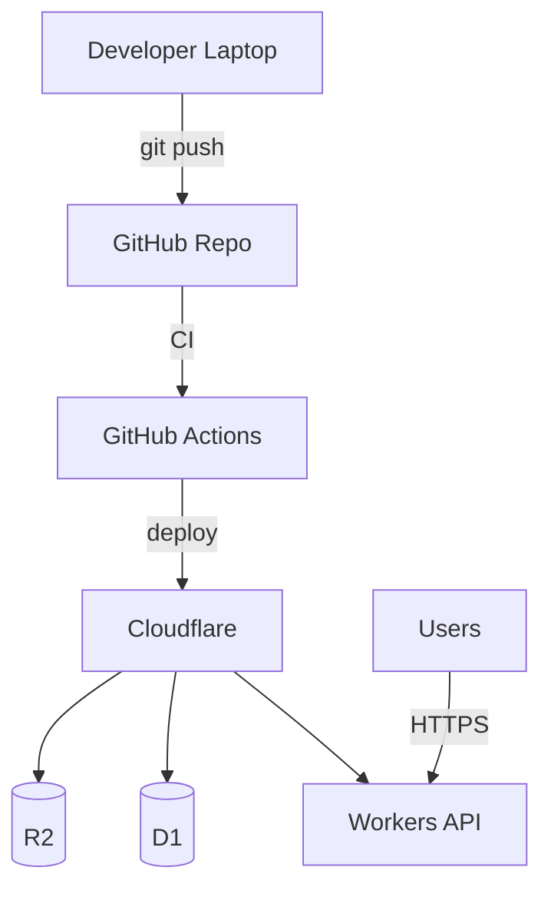

# Infrastructure & Deployment

CiCwtch uses Cloudflare as an edge-first BFF platform: low latency, simple ops, strong regional performance.

---

## 1) Environments

- **Local**: Flutter dev + local mocks (optional), SQLite
- **Staging**: Cloudflare Workers + D1 + R2 (separate accounts or namespaces)
- **Production**: Cloudflare Workers + D1 + R2 (prod resources, strict secrets)

Environment parity matters. “Works on my laptop” is not a deployment strategy.

---

## 2) Deployment topology

---

## 3) CI/CD expectations

CI should run at minimum:
- format/lint
- unit tests (domain + use cases)
- integration tests (API contracts where possible)
- build checks for Web/iOS/Android targets (as appropriate)

CD should:
- deploy Workers to staging on merge to main (or release branches)
- promote to production via tagged release / manual approval gate

---

## 4) Observability

### Logging
- Workers logs for API requests, errors, and key workflow events
- Correlation IDs:
  - generated per request, returned to client, logged server-side

### Metrics (at minimum)
- request latency (p50/p95)
- error rate (4xx/5xx)
- sync success/failure counts
- webhook processing success/failure

### Health checks
- `/health` endpoint (no auth) for platform monitoring
- `/ready` endpoint (internal) verifying D1 connectivity (if feasible)

---

## 5) Backups & data retention (policy)

- D1 backup/exports strategy documented here when implemented
- R2 retention rules per object type:
  - walk photos (retention policy)
  - invoices (longer retention)
