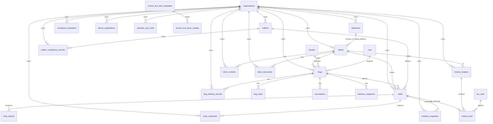

<!-- HEADER BADGES -->

&nbsp;

&nbsp;
  

# CiCwtch - Database ERD
## Mermaid entity-relationship view of the current D1 baseline

  
  &nbsp;
  
  &nbsp;
  

The diagram below is the quickest way to understand the current CiCwtch relational model.

- Tenant-owned tables carry `organisation_id`.
- Global reference tables do not.
- R2 file binaries are intentionally outside the ERD; only metadata pointers live in D1.

## Notes

- Use the [data dictionary](data-dictionary.md) for field-level explanations.
- Use [schema notes and constraints](schema-notes.md) for uniqueness, FK behaviour, indexing, and deletion rules.
- Keep the Mermaid source in [`erd.mmd`](erd.mmd) aligned with any schema change.

---

  Built in Wales ❤️ Designed with Cwtch 
  Adeiladwyd yng Nghymru ❤️ Dyluniwyd gyda Cwtch

